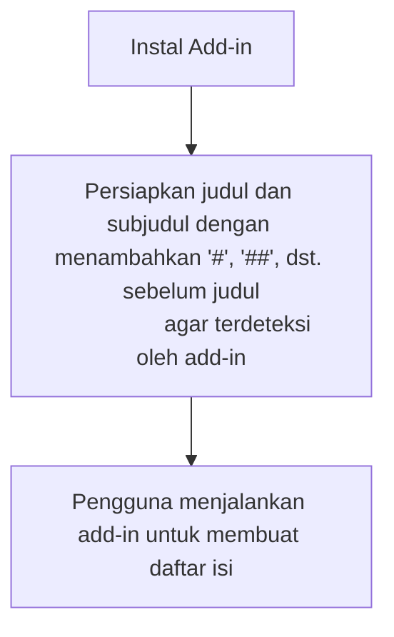
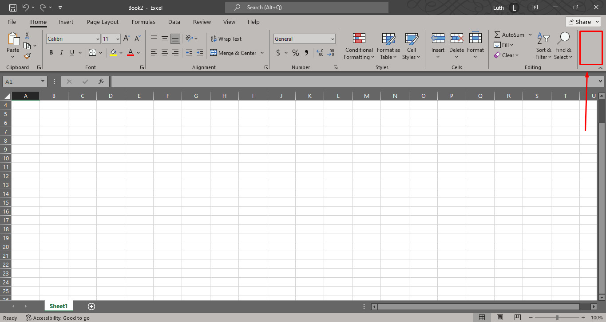

# Daftar Isi

- [Daftar Isi](#daftar-isi)
- [Gambaran Awal](#gambaran-awal)
- [Skenario-Skenario](#skenario-skenario)
  - [Skenario 1: Agus](#skenario-1-agus)
- [Flowchart Excel Bookmarks](#flowchart-excel-bookmarks)
- [Spesifikasi Tampilan-Tampilan Excel Bookmarks](#spesifikasi-tampilan-tampilan-excel-bookmarks)
  - [Letak Tombol Pengaktifan Excel Bookmarks](#letak-tombol-pengaktifan-excel-bookmarks)
  - [Utama](#utama)

# Gambaran Awal

Excel Bookmarks adalah add-in untuk membuat daftar isi dengan cepat. Seperti di Microsoft Word.

Spesifikasi ini masih dalam tahap penulisan, dan belum lengkap.

Spesifikasi ini tidak membahas cara kerja internal Excel Bookmarks, melainkan menjelaskan apa yang (seharusnya) dilihat pengguna saat memakai produk ini.

# Skenario-Skenario

## Skenario 1: Agus

Bapak Agus adalah jurnalis yang sangat menguasai statistika. Tiap artikel berita yang dia tulis mengandung paling sedikit 86 grafik, table, dan perhitungan.

Tapi, Bapak Agus sudah mulai tua. Ia sudah tidak dapat menangani dan mengingat letak ratusan grafik sekaligus di Excel. Untungnya, Bapak Agus menemukan add-in Excel Bookmarks. Dengan memakai add-in ini, Bapak Agus sudah tidak perlu mengingat letak dan mencari-cari grafik yang ia inginkan, karena sudah dibuatkan daftar isi oleh Excel Bookmarks. Semudah menekan tombol untuk mencari grafik yang ia inginkan.

# Flowchart Excel Bookmarks

# Spesifikasi Tampilan-Tampilan Excel Bookmarks

Tiap nama tampilan akan ditampilkan sebagai link, agar lebih jelas. Contohnya seperti tampilan [utama](#utama)

## Letak Tombol Pengaktifan Excel Bookmarks

Tombol untuk membuka Excel Bookmarks akan ditaruh di tempat yang ditandai persegi merah pada gambar di atas. Menekan tombol ini akan menampilkan tampilan samping [utama](#utama)

## Utama

> **\# Excel Bookmarks**
>
> Persiapkan dokumen Anda dengan menambahkan '#', '##', atau '###' untuk menandakan subjudul. Sebagai contoh, lihat gambar di bawah.
>
> > [Subjudul Tingkat 1] --> [# Subjudul Tingkat 1]
> >
> > [Subjudul Tingkat 2] --> [## Subjudul Tingkat 2]
>
> Setelah itu, tekan tombol **Ciptakan**
>
> [**CIPTAKAN**]

Saat pengguna menekan tombol **Ciptakan**, maka pengguna akan diminta untuk menyeleksi sebuah sel sebagai lokasi daftar isi.
